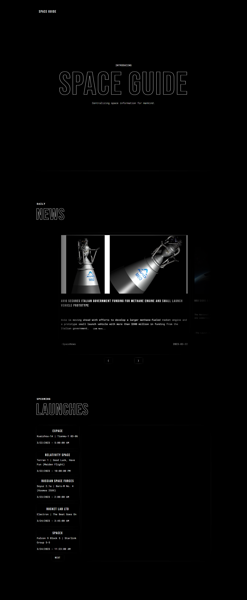

# Space Guide

## Description

- Space Guide is my first interactive responsive web application that provides space news and upcoming launch information for outer space enthusiasts.

## Tools

-Vanilla JavaScript, CSS, SASS, V2 Launch API.

## Resources

[Link](https://space-guide.netlify.app/)

